<div align="center">


<p align="center">
  
</p>

<p align="center">
  <a href="https://www.python.org/">
    
  </a>
  <a href="LICENSE">
    
  </a>
  <a href="https://github.com/devmdave/TrainIT">
    
  </a>
  <a href="https://github.com/devmdave/TrainIT/stargazers">
    
  </a>
</p>

<p align="center">
  <a href="#-features"><b>Features</b></a> •
  <a href="#-installation"><b>Installation</b></a> •
  <a href="#-quick-start"><b>Quick Start</b></a> •
  <a href="#-usage"><b>Usage</b></a> •
  <a href="#-documentation"><b>Docs</b></a> •
  <a href="#-contributing"><b>Contributing</b></a>
</p>


</div>

<br/>

<div align="center">

## 📋 Overview

```mermaid
%%{init: {'theme':'base', 'themeVariables': { 'primaryColor':'#6366f1','primaryTextColor':'#fff','primaryBorderColor':'#4f46e5','lineColor':'#818cf8','secondaryColor':'#a78bfa','tertiaryColor':'#c4b5fd','fontSize':'16px'}}}%%
graph LR
    A[📁 Select Dataset] --> B[⚙️ Configure Model]
    B --> C[🚀 Train]
    C --> D[📊 Evaluate]
    D --> E[💾 Export Model]
    style A fill:#10b981,stroke:#059669,stroke-width:3px,color:#fff
    style B fill:#3b82f6,stroke:#2563eb,stroke-width:3px,color:#fff
    style C fill:#f59e0b,stroke:#d97706,stroke-width:3px,color:#fff
    style D fill:#8b5cf6,stroke:#7c3aed,stroke-width:3px,color:#fff
    style E fill:#ef4444,stroke:#dc2626,stroke-width:3px,color:#fff
```

 **TrainIT** is a powerful, user-friendly GUI application that streamlines the machine learning model training process. Say goodbye to complex command-line operations and hello to intuitive, visual model training! 

</div>

<br/>

<div align="center">



</div>

<br/>

<div align="center">
  
</div>

<br/>

<div align="center">

## ✨ Features


</div>

<table>
<tr>
<td width="50%">

### 🎯 **Intuitive GUI**

✅ Clean, modern interface  
✅ Drag-and-drop dataset loading  
✅ Real-time training visualization  
✅ Progress tracking with metrics

</td>
<td width="50%">

### ⚡ **Automated Training**

✅ One-click model training  
✅ Automatic hyperparameter tuning  
✅ Multi-model comparison  
✅ Best model selection

</td>
</tr>
<tr>
<td width="50%">

### 📊 **Comprehensive Analytics**

✅ Training/validation curves  
✅ Performance metrics dashboard  
✅ Confusion matrix visualization  
✅ Model comparison charts

</td>
<td width="50%">

### 🔧 **Flexible Configuration**

✅ Multiple ML frameworks  
✅ Custom model architectures  
✅ Train/test split configuration  
✅ Cross-validation support

</td>
</tr>
</table>

<div align="center">
  
</div>

<br/>

<div align="center">

## 🚀 Quick Start


</div>

### 📋 Prerequisites

- Python 3.8 or higher
- pip package manager

### ⚡ Installation

```bash
# 📥 Clone the repository
git clone https://github.com/devmdave/TrainIT.git
cd TrainIT

# 📦 Install dependencies
pip install -r requirements.txt

# 🚀 Launch TrainIT
python main.py
```

<div align="center">

**🎉 That's it! You're ready to train your models!**


</div>

<br/>

<div align="center">

## 💡 Usage


</div>

### **Step 1:** Launch the Application
```bash
python main.py
```

### **Step 2:** Load Your Dataset
- 📂 Browse and select your **training dataset**
- 🧪 Browse and select your **test dataset**  
- 📊 Supported formats: CSV, Excel, JSON, Parquet

### **Step 3:** Configure & Train
- ⚙️ Select your preferred ML model
- 🎚️ Adjust hyperparameters (or use auto-tuning)
- 🚀 Click **Train** to start the process
- 📈 Monitor real-time progress and metrics

### **Step 4:** Evaluate & Export
- 📊 Review comprehensive performance metrics
- 💾 Export your trained model
- 📄 Generate detailed analysis reports

<div align="center">

### 🎯 Supported File Formats


</div>

<br/>

<div align="center">

## 🎨 Screenshots


</div>

### 🖥️ Main Interface
<p align="center">
  
</p>
<p align="center"><i>Beautiful, intuitive design for seamless workflow</i></p>

### 📊 Training Dashboard  
<p align="center">
  
</p>
<p align="center"><i>Real-time metrics and visualizations at your fingertips</i></p>

### 📈 Results Analysis
<p align="center">
  
</p>
<p align="center"><i>Comprehensive model performance insights</i></p>

<div align="center">
  
</div>

<br/>

<div align="center">

## 🛠️ Supported Features


</div>

### 📁 Data Support
- ✅ CSV Dataset
- ✅ Excel Dataset  
- ✅ JSON Dataset
- ✅ Parquet Files

### 🤖 ML Capabilities
- ✅ Multiple Algorithms
- ✅ Auto Model Selection
- ✅ Hyperparameter Tuning
- ✅ Cross-validation

### 📊 Visualization & Export
- ✅ Real-time Charts
- ✅ Model Export
- ✅ Performance Metrics
- ✅ Report Generation

<div align="center">

### 🔧 Supported ML Frameworks


</div>

<br/>

<div align="center">

## 📚 Documentation


</div>

For detailed documentation, visit our [Wiki](https://github.com/devmdave/TrainIT/wiki) or explore:

- 📖 [Getting Started Guide](docs/getting-started.md)
- ⚙️ [Configuration Options](docs/configuration.md)
- 📡 [API Reference](docs/api-reference.md)
- ❓ [FAQ](docs/faq.md)
- 🎥 [Video Tutorials](docs/tutorials.md)
- 💻 [Code Examples](docs/examples.md)
- 🐛 [Troubleshooting](docs/troubleshooting.md)

<br/>

<div align="center">

## 🤝 Contributing


**We ❤️ contributions! Join our amazing community of developers!**

</div>

<div align="center">


</div>

**How to contribute:**

1. 🍴 **Fork** the repository
2. 🔨 **Create** a feature branch (`git checkout -b feature/AmazingFeature`)
3. 💻 **Make** your changes
4. ✅ **Commit** your changes (`git commit -m 'Add AmazingFeature'`)
5. 📤 **Push** to the branch (`git push origin feature/AmazingFeature`)
6. 🎉 **Open** a Pull Request

<div align="center">

### 👥 Contributors

<a href="https://github.com/devmdave/TrainIT/graphs/contributors">
  
</a>

<br/><br/>

**Thank you to all our amazing contributors! 🎉**


</div>

<br/>

<div align="center">

## 📝 License


This project is licensed under the **MIT License** - see the [LICENSE](LICENSE) file for details.


</div>

---

<div align="center">

## 🙏 Acknowledgments


**Built with ❤️ and powered by:**


<br/><br/>

- 🧠 **ML Libraries:** TensorFlow, PyTorch, Scikit-learn
- 💻 **Development:** Python Community
- 👥 **Contributors:** Amazing Open Source Community  
- ☕ **Fuel:** Coffee & Pizza

</div>

---

<div align="center">

## 📧 Contact & Support


<br/>

<a href="https://github.com/devmdave/TrainIT/issues">
  
</a>
<a href="https://github.com/devmdave/TrainIT/issues">
  
</a>
<a href="https://github.com/devmdave/TrainIT/discussions">
  
</a>

<br/><br/>

### 📱 Connect With Us

<a href="https://twitter.com/devmdave">
  
</a>
<a href="https://linkedin.com/in/devmdave">
  
</a>
<a href="https://discord.gg/trainit">
  
</a>

</div>

---

<div align="center">


### ⭐ If you like TrainIT, give it a star! It really motivates us! ⭐

<a href="https://github.com/devmdave/TrainIT/stargazers">
  
</a>
<a href="https://github.com/devmdave/TrainIT/network/members">
  
</a>
<a href="https://github.com/devmdave/TrainIT/watchers">
  
</a>

<br/><br/>

**Made with 💻 and ☕ by [devmdave](https://github.com/devmdave)**


</div>
